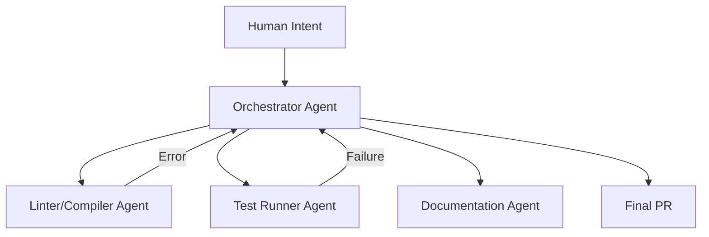

In 2026, the landscape of software development has fundamentally shifted. We no longer talk about "AI-assisted coding"; we talk about **Agentic Coding**. 

### The Shift from Copilots to Agents

Back in 2023 and 2024, we were impressed by "Copilots"—tools that suggested lines of code or completed functions. They were like a very fast junior developer looking over your shoulder. But they were reactive. You had to prompt them for every small step.

In 2026, agents like **Kevelino-OS** (a fictional representation of the modern workflow) are proactive. They don't just write code; they manage the entire lifecycle:

1.  **Requirement Synthesis**: Agents participate in design docs, identifying edge cases before a single line is written.
2.  **Autonomous Implementation**: You describe a feature at a high level ("Add a multi-tenant billing system with Stripe integration"), and the agent creates the migrations, service layers, and frontend components.
3.  **Self-Correction Loop**: The agent runs the test suite, logs the errors, and fixes the code until it passes—all without human intervention.

### The New Architecture: Logic vs. Orchestration

We've moved away from standard MVC patterns into **Agentic Orchestration Layers**. 

### Why It Matters

This isn't just about speed; it's about **complexity management**. An agentic system can keep 100,000 lines of code in its context, understanding the ripple effects of a change in a core utility file that a human might miss.

### The 2026 Reality

Today, a "senior developer" is effectively a **Development Orchestrator**. We spend our time reviewing agent thoughts, verifying architectural integrity, and focusing on the *why* instead of the *how*. Coding has become a discipline of high-level logic and system design, while the "grunt work" of syntax and boilerplate is handled by our agentic partners. We are spending less time typing and more time defining the boundaries and goals for our digital agents.

> "The keyboard is becoming a tool for high-level orchestration, rather than character-by-character input."

As we move further into 2026, the synergy between human creativity and agentic precision is reaching new heights.
